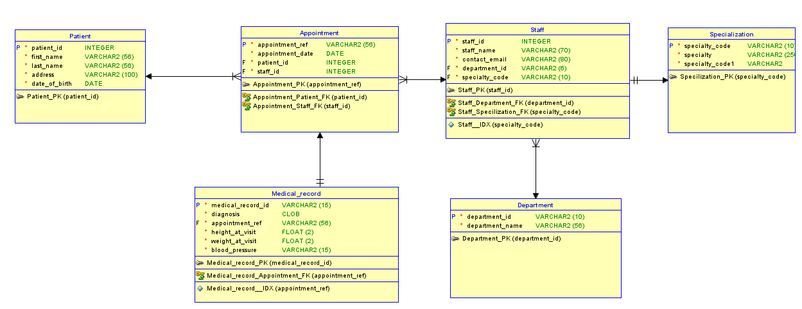

## Patient-Information-Management-System

A Patient Appointment Management System is a system with an application interface that helps the Surgery uniquely manage their patients' information. The need for patient information management arises from the requirement to access patient data across various levels, including diagnosis and service payment within the healthcare facility.
A patient information system plays a vital part in improving the patient experience, and the surgery’s workflow, and optimizing resource allocations.
This project focus on creating a database system for a surgery, it explains the stages from data gathering, data modelling, normalization and security steps taken to ensure the database system is secure. 

